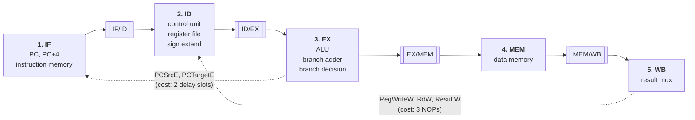
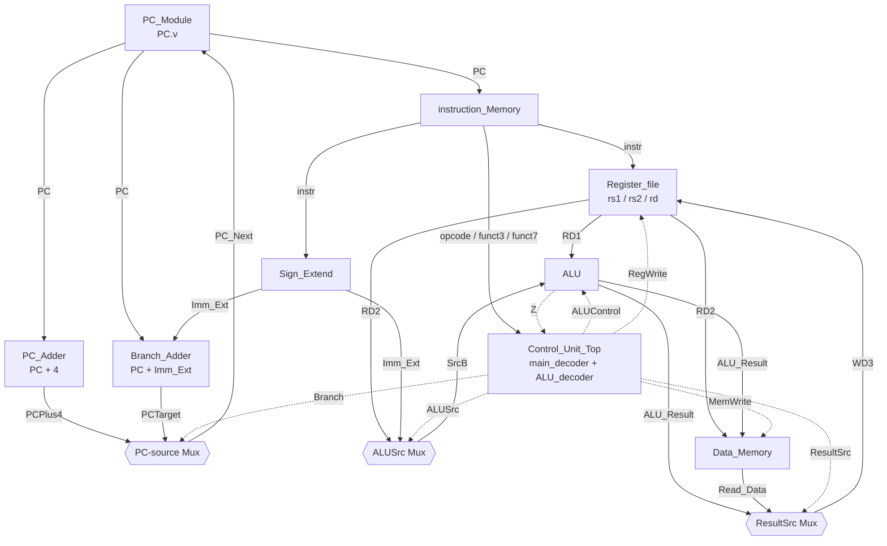

# RV32I Core — Single-Cycle → 5-Stage Pipeline

A from-scratch RV32I processor core in Verilog, built in stages: a working Harris & Harris–style
single-cycle datapath first, then a 5-stage pipeline (IF → ID → EX → MEM → WB) with forwarding,
hazard detection, stalling and flushing — with FPGA verification on a PYNQ-Z2 as the end goal.

> **Status:** ✅ Single-cycle core — 12/12 self-checking regression ·
> ✅ 5-stage pipeline registers (IF/ID, ID/EX, EX/MEM, MEM/WB) — 12/12 regression ·
> 🚧 Hazard unit, forwarding and flushing next
>
> Developed and documented openly as I build it, so pipeline features land incrementally.

Both cores run the **same 12 architectural checks** — they differ in schedule, not in what
the program computes.

| Document | Covers |
|---|---|
| [**docs/RV32I_Single_Cycle_Core.pdf**](docs/RV32I_Single_Cycle_Core.pdf) | The single-cycle datapath, control tables, the branch-resolution post-mortem, verification strategy |
| [**docs/RV32I_Pipeline_Stages.pdf**](docs/RV32I_Pipeline_Stages.pdf) | How `src/` splits that datapath into five stages: the four pipeline registers, the two backward paths, and the derived NOP-scheduling rules |

## Architecture

### 5-stage pipeline (`src/`)

Five stage modules separated by four pipeline registers (the `[[double-bracket]]` blocks).
Solid arrows flow forward — one instruction advances one stage per clock edge. The two dotted
arrows run **backwards**, and they are where all the difficulty in pipelining comes from:



| Backward path | Why it exists | Cost in this build |
|---|---|---|
| `PCSrcE`, `PCTargetE` (EX → IF) | A branch resolves in EX, but the PC lives in IF — two instructions are already fetched by then | 2 delay-slot NOPs after a taken branch |
| `RegWriteW`, `RdW`, `ResultW` (WB → ID) | The register file is read in ID but written from WB, four stages later, with no write-through bypass | 3 NOPs between dependent instructions |

Both costs are paid **in software** — there is no hazard detection, forwarding, stalling or
flushing yet. Every NOP in [`src/program.hex`](src/program.hex) is derived from clock
arithmetic and annotated in place; the derivations are in the pipeline PDF (§9).

### Single-cycle datapath (`single_core/`)

The reference implementation the pipeline was cut from (dotted lines are control signals):



### Modules (`src/`) — the pipeline

| Module (file) | Role |
|---|---|
| `Fetch_Cycle` (`Fetch_Cycle.v`) | Stage 1 — PC, PC+4, instruction memory, PC-source mux, **IF/ID register** |
| `Decode_Cycle` (`Decode_Cycle.v`) | Stage 2 — control unit, register file, sign extend, **ID/EX register** |
| `Execute_Cycle` (`Execute_Cycle.v`) | Stage 3 — ALU, branch adder, branch decision, **EX/MEM register** |
| `Memory_Cycle` (`Memory_Cycle.v`) | Stage 4 — data memory, **MEM/WB register** |
| `Writeback_Cycle` (`Writeback_Cycle.v`) | Stage 5 — result mux only; no pipeline register (there is no stage 6) |
| `Pipeline_Top` (`Pipeline_Top.v`) | Wiring and includes only — no logic |

Every signal carries a stage suffix (`F` `D` `E` `M` `W`) naming where it lives, so `RD2E`
and `RD2M` are visibly the same wire one cycle apart. The moment a signal crosses a pipeline
register, its letter changes.

### Modules (`single_core/`) — reused unchanged

Not one line of these was edited to pipeline the core. Pipelining a processor doesn't change
its functional units — it puts registers *between* them. Keeping `single_core/` frozen also
means any pipeline failure is provably a pipelining bug.

| Module (file) | Role |
|---|---|
| `PC_Module` (`PC.v`) | Program counter register |
| `PC_Adder` (`PC_Adder.v`) | Generic adder — instanced twice, for `PC+4` and the branch target |
| `instruction_Memory` (`instruction_Memory.v`) | Instruction fetch memory, loads `program.hex` |
| `Register_file` (`Register_file.v`) | 32×32-bit, dual read / single write |
| `Sign_Extend` (`Sign_Extend.v`) | I / S / B-type immediate extension |
| `ALU` (`ALU.v`) | add, sub, and, or, slt + Z/N/C/V flags |
| `ALU_decoder` (`ALU_decoder.v`) | ALU control from `ALUOp`/`funct3`/`funct7` |
| `main_decoder` (`main_decoder.v`) | Top-level control signal generation |
| `Control_Unit_Top` (`Control_Unit_Top.v`) | Wraps main + ALU decoders |
| `Data_Memory` (`Data_Mem.v`) | Load/store data memory |
| `Single_Cycle_Top` (`Single_Cycle_Top.v`) | Datapath integration |

### Instruction support

Both cores support the same subset, and both regression programs assert the same 12 results:

| Type | Instructions | Verified by |
|---|---|---|
| R-type | `add` `sub` `and` `or` `slt` | `x3=8`, `x4=2`, `x5=1`, `x6=7`, `x7=1` / `x8=0` |
| I-type | `addi` `lw` | `x1=5`, `x2=3` / `x9=8` |
| S-type | `sw` | stores `x3` to `mem[0]`, read back into `x9` |
| B-type | `beq` | not taken → `x10=1`; taken → `x11` stays `0`, `x12=7` |

## Simulation

Built with [Icarus Verilog](http://iverilog.icarus.com/), waveforms viewed in
[GTKWave](http://gtkwave.sourceforge.net/).

**Pipelined core:**

```bash
cd src

iverilog -I ../single_core -o out.vvp Pipeline_Top_TestBench.v   # compile
vvp out.vvp                                                      # run the regression
gtkwave Pipeline_Top_TestBench.vcd                               # inspect waveforms
```

> The `-I ../single_core` flag is **required**. A plain
> `` `include "../single_core/Control_Unit_Top.v" `` won't work: that file itself does
> `` `include "main_decoder.v" ``, and a nested include resolves relative to the *current
> working directory*, not the including file — so the inner include fails. The search path
> resolves correctly at every level.

**Single-cycle core:**

```bash
cd single_core

iverilog -o out.vvp Single_Cycle_Top_TestBench.v   # compile
vvp out.vvp                                        # run the regression
gtkwave Single_Cycle_Top_TestBench.vcd             # inspect waveforms
```

Both testbenches are **self-checking** — they assert the expected final register state rather
than relying on a manual waveform read:

```
=== 5-stage pipelined RV32I regression (src/program.hex) ===
  ok  : x1 = 5
  ...
  ok  : x12 = 7
RESULT: PASS - all 12 checks passed
```

`vvp` also prints a `$readmemh: Not enough words in the file for the requested range` warning.
That one is expected and harmless — the program is far shorter than the 1024-word instruction
memory, and the remainder is deliberately zero-filled with NOPs.

### Running your own program

Programs live in [`src/program.hex`](src/program.hex) and
[`single_core/program.hex`](single_core/program.hex) — one 32-bit instruction per line in hex,
`//` comments allowed — and are loaded with `$readmemh`, so swapping programs does **not**
require editing or recompiling the RTL. If you change a program, update the `check_reg`
expectations at the bottom of the matching testbench.

⚠️ **On the pipelined core you must schedule hazards yourself.** With no forwarding or flush
logic, a dependent instruction needs **3 NOPs** after its producer, and a taken branch needs
**2 delay-slot NOPs**. The header of [`src/program.hex`](src/program.hex) derives both numbers
from clock arithmetic; §9 of the pipeline PDF walks through the derivation and confirms it
experimentally.

## Repository Structure

```
.
├── docs/
│   ├── RISC-V Project.md              # Design notes / project journal
│   ├── RV32I_Single_Cycle_Core.pdf    # Single-cycle core documentation
│   ├── RV32I_Pipeline_Stages.pdf      # Pipeline implementation walkthrough
│   ├── generate_pdf.py                # Regenerates the single-cycle PDF
│   └── generate_pipeline_pdf.py       # Regenerates the pipeline PDF
├── single_core/             # Single-cycle RV32I implementation + regression
│   ├── *.v                  # Datapath and control modules (reused by src/, unchanged)
│   ├── program.hex          # Test program, loaded via $readmemh
│   ├── Single_Cycle_Top_TestBench.v           # Self-checking testbench
│   └── Single_Cycle_Top_TestBench.vcd(.gtkw)  # Waveform + GTKWave session
└── src/                     # 5-stage pipeline + regression
    ├── Fetch_Cycle.v        # Stage 1 (IF)  + IF/ID register
    ├── Decode_Cycle.v       # Stage 2 (ID)  + ID/EX register
    ├── Execute_Cycle.v      # Stage 3 (EX)  + EX/MEM register
    ├── Memory_Cycle.v       # Stage 4 (MEM) + MEM/WB register
    ├── Writeback_Cycle.v    # Stage 5 (WB)  — no register; loops back to ID
    ├── Pipeline_Top.v       # Wiring and includes only
    ├── program.hex          # Test program with derived NOP scheduling
    └── Pipeline_Top_TestBench.v               # Self-checking testbench
```

Both PDFs are generated by the committed scripts (`python docs/generate_pipeline_pdf.py`), so
they're regenerable rather than binary blobs nobody can update.

## Design Notes

### Pipeline (`src/`)

- **Control signals are pipelined data.** `MemWrite` is decoded in ID but the data memory
  doesn't run until MEM, three cycles later. Wiring the decoder straight to the memory would
  make it obey whichever instruction happens to be in decode at that moment. So control bits
  ride the same pipeline registers as the data — each instruction drags a backpack of control
  bits down the pipe. `RegWrite` has the longest trip: decoded in ID, used in WB.
- **`Control_Unit_Top` is instantiated with `.zero(1'b1)` — this is deliberate, not the old
  bug.** The decoder computes `Branch = <is a branch opcode> & zero`, but in a pipeline the
  zero flag doesn't exist until the ALU runs in EX. Tying `zero` high extracts just the raw
  opcode bit (`x & 1 == x`); the real test is completed in EX as `PCSrcE = BranchE & ZeroE`.
  The logic isn't weakened — it's *split across two stages*. Contrast the genuine defect the
  single-cycle core once had, where the same port was hardcoded to `1'b0` (`x & 0 == 0`
  destroys the condition entirely).
- **The branch adder moved from IF to EX.** The target is `PC + immediate`, and the immediate
  doesn't exist until sign-extension runs in ID. Putting it in EX rather than ID keeps the
  target and the branch decision in one stage, so only *one* backward bundle routes up to
  fetch. Knock-on effect: `PC` must be carried IF → ID → EX.
- **`PC+4` is deliberately not pipelined.** Textbooks carry it to WB because `jal` writes the
  return address to `rd`. This core has no `jal`, so `PC+4` has exactly one consumer — the PC
  mux in fetch — and never leaves that stage. It goes in the moment `jal` does.
- **The 3-NOP rule was verified, not just derived.** Rebuilding with only 2 NOPs produced
  `x3 = 5` instead of `8` — `x1` read correctly while `x2` was still stale, which is precisely
  the failure the arithmetic predicts. One operand correct and the other stale, in the same
  instruction, is a signature that doesn't happen by accident.

### Single-cycle (`single_core/`)

- **Branch resolution was the subtle one.** `beq` decoded correctly but never redirected fetch:
  the ALU's `Z` flag was left unconnected, `Control_Unit_Top` hardcoded `zero = 0`, and there was
  no branch-target adder or PC-source mux at all — the PC only ever received `PC+4`. Fixed by
  wiring `Z` through and adding `Branch_Adder` plus the `PC_Next` mux. Search the RTL for
  `//FIX:` to see each change in context.
- **Reset clears the register file** rather than only forcing reads to zero, so stale values
  can't resurface once `rst` deasserts.
- **Both memories zero-fill at time 0**, so unwritten locations read as `0` — a harmless NOP in
  instruction memory — instead of smearing X through the register file and waveform.
- **Known limitation:** `slt` uses only the sign bit of `A - B` (the standard Harris & Harris
  simplification), so it is subtly incorrect on signed overflow.

## Roadmap

- [x] Single-cycle RV32I datapath
- [x] Branch resolution (zero flag → PC-source mux → branch target)
- [x] Self-checking regression covering every supported instruction
- [x] Pipeline registers (IF/ID, ID/EX, EX/MEM, MEM/WB) + self-checking pipeline regression
- [ ] EX/MEM and MEM/WB forwarding paths
- [ ] Hazard detection unit + load-use stall logic
- [ ] Branch flush logic
- [ ] PYNQ-Z2 FPGA synthesis and on-board verification

The remaining pipeline features have a concrete, falsifiable definition of done: **each one
deletes NOPs from `src/program.hex` while the same 12 assertions keep passing.** Forwarding
removes the 3 data-hazard NOPs; flush logic removes the 2 delay slots and returns the branch
offset to `+8`. Forwarding comes first — it removes the most NOPs for the least logic — then
the load-use stall, which is the one case forwarding provably can't fix.

## Author

**Swastik** ([@dr-paradox-design](https://github.com/dr-paradox-design)) — B.Tech Electrical
Engineering, NIT Rourkela. Built as part of an ongoing push into digital/ASIC design fundamentals.

## License

No license file yet — MIT is a common choice for educational cores if you want others to reuse this.
