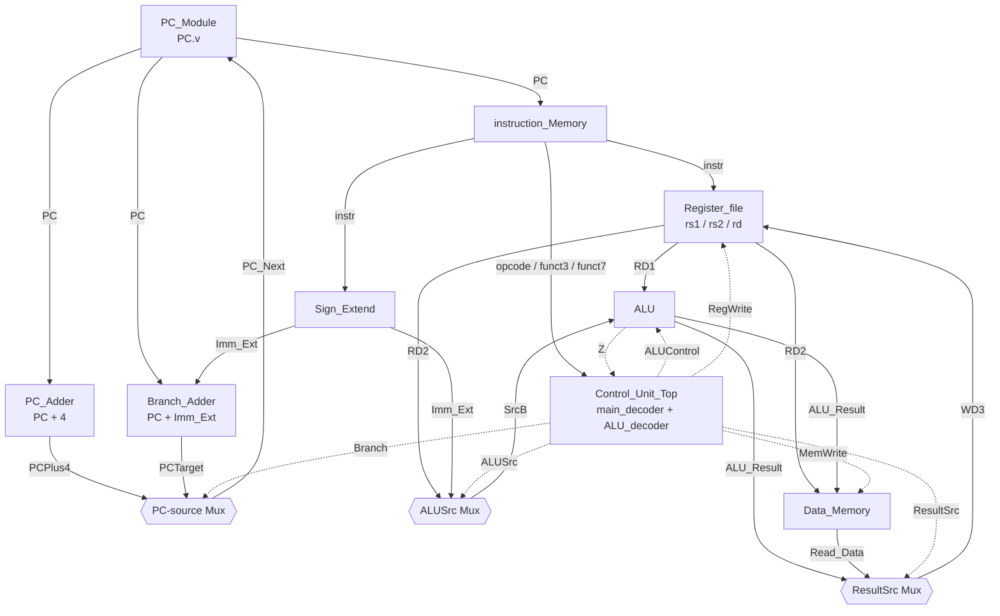

# RV32I Core — Single-Cycle → 5-Stage Pipeline

A from-scratch RV32I processor core in Verilog, built in stages: a working Harris & Harris–style
single-cycle datapath first, then a 5-stage pipeline (IF → ID → EX → MEM → WB) with forwarding,
hazard detection, stalling and flushing — with FPGA verification on a PYNQ-Z2 as the end goal.

> **Status:** ✅ Single-cycle core implemented, verified by a self-checking regression ·
> 🚧 5-stage pipeline in progress
>
> Developed and documented openly as I build it, so pipeline stages land incrementally.

Full write-up — datapath, control tables, the branch-resolution post-mortem, verification
strategy and pipeline plan — is in
[**docs/RV32I_Single_Cycle_Core.pdf**](docs/RV32I_Single_Cycle_Core.pdf).

## Architecture

The single-cycle datapath as currently wired (dotted lines are control signals):



### Modules (`single_core/`)

| Module (file) | Role |
|---|---|
| `PC_Module` (`PC.v`) | Program counter register |
| `PC_Adder` (`PC_Adder.v`) | Generic adder — instanced twice, for `PC+4` and the branch target |
| `instruction_Memory` (`instruction_Memory.v`) | Instruction fetch memory, loads `program.hex` |
| `Register_file` (`Register_file.v`) | 32×32-bit, dual read / single write |
| `Sign_Extend` (`Sign_Extend.v`) | I / S / B-type immediate extension |
| `ALU` (`ALU.v`) | add, sub, and, or, slt + Z/N/C/V flags |
| `ALU_decoder` (`ALU_decoder.v`) | ALU control from `ALUOp`/`funct3`/`funct7` |
| `main_decoder` (`main_decoder.v`) | Top-level control signal generation |
| `Control_Unit_Top` (`Control_Unit_Top.v`) | Wraps main + ALU decoders |
| `Data_Memory` (`Data_Mem.v`) | Load/store data memory |
| `Single_Cycle_Top` (`Single_Cycle_Top.v`) | Datapath integration |

### Instruction support

Every supported instruction is exercised by the committed regression program:

| Type | Instructions | Verified by |
|---|---|---|
| R-type | `add` `sub` `and` `or` `slt` | `x3=8`, `x4=2`, `x5=1`, `x6=7`, `x7=1` / `x8=0` |
| I-type | `addi` `lw` | `x1=5`, `x2=3` / `x9=8` |
| S-type | `sw` | stores `x3` to `mem[0]`, read back into `x9` |
| B-type | `beq` | not taken → `x10=1`; taken → `x11` stays `0`, `x12=7` |

## Simulation

Built with [Icarus Verilog](http://iverilog.icarus.com/), waveforms viewed in
[GTKWave](http://gtkwave.sourceforge.net/).

```bash
cd single_core

iverilog -o out.vvp Single_Cycle_Top_TestBench.v   # compile
vvp out.vvp                                        # run the regression
gtkwave Single_Cycle_Top_TestBench.vcd             # inspect waveforms
```

The testbench is **self-checking** — it asserts the expected final register state rather than
relying on a manual waveform read:

```
=== single-cycle RV32I regression (program.hex) ===
  ok  : x1 = 5
  ...
  ok  : x12 = 7
RESULT: PASS - all 12 checks passed
```

`vvp` also prints a `$readmemh: Not enough words in the file for the requested range` warning.
That one is expected and harmless — the program is far shorter than the 1024-word instruction
memory, and the remainder is deliberately zero-filled with NOPs.

### Running your own program

Programs live in [`single_core/program.hex`](single_core/program.hex) — one 32-bit instruction
per line in hex, `//` comments allowed — and are loaded with `$readmemh`, so swapping programs
does **not** require editing or recompiling the RTL. If you change the program, update the
`check_reg` expectations at the bottom of `Single_Cycle_Top_TestBench.v` to match.

## Repository Structure

```
.
├── docs/
│   ├── RISC-V Project.md              # Design notes / project journal
│   ├── RV32I_Single_Cycle_Core.pdf    # Full project documentation
│   └── generate_pdf.py                # Regenerates the PDF above
├── single_core/             # Single-cycle RV32I implementation + regression
│   ├── *.v                  # Datapath and control modules
│   ├── program.hex          # Test program, loaded via $readmemh
│   ├── Single_Cycle_Top_TestBench.v           # Self-checking testbench
│   └── Single_Cycle_Top_TestBench.vcd(.gtkw)  # Waveform + GTKWave session
└── src/
    └── Fetch_Cycle          # Placeholder for pipeline IF-stage work (not started yet)
```

## Design Notes

- **Branch resolution was the subtle one.** `beq` decoded correctly but never redirected fetch:
  the ALU's `Z` flag was left unconnected, `Control_Unit_Top` hardcoded `zero = 0`, and there was
  no branch-target adder or PC-source mux at all — the PC only ever received `PC+4`. Fixed by
  wiring `Z` through and adding `Branch_Adder` plus the `PC_Next` mux. Search the RTL for
  `//FIX:` to see each change in context.
- **Reset clears the register file** rather than only forcing reads to zero, so stale values
  can't resurface once `rst` deasserts.
- **Both memories zero-fill at time 0**, so unwritten locations read as `0` — a harmless NOP in
  instruction memory — instead of smearing X through the register file and waveform.
- **Known limitation:** `slt` uses only the sign bit of `A - B` (the standard Harris & Harris
  simplification), so it is subtly incorrect on signed overflow.

## Roadmap

- [x] Single-cycle RV32I datapath
- [x] Branch resolution (zero flag → PC-source mux → branch target)
- [x] Self-checking regression covering every supported instruction
- [ ] Pipeline registers (IF/ID, ID/EX, EX/MEM, MEM/WB)
- [ ] Hazard detection unit + load-use stall logic
- [ ] EX/MEM and MEM/WB forwarding paths
- [ ] Branch flush logic
- [ ] PYNQ-Z2 FPGA synthesis and on-board verification

## Author

**Swastik** ([@dr-paradox-design](https://github.com/dr-paradox-design)) — B.Tech Electrical
Engineering, NIT Rourkela. Built as part of an ongoing push into digital/ASIC design fundamentals.

## License

No license file yet — MIT is a common choice for educational cores if you want others to reuse this.
