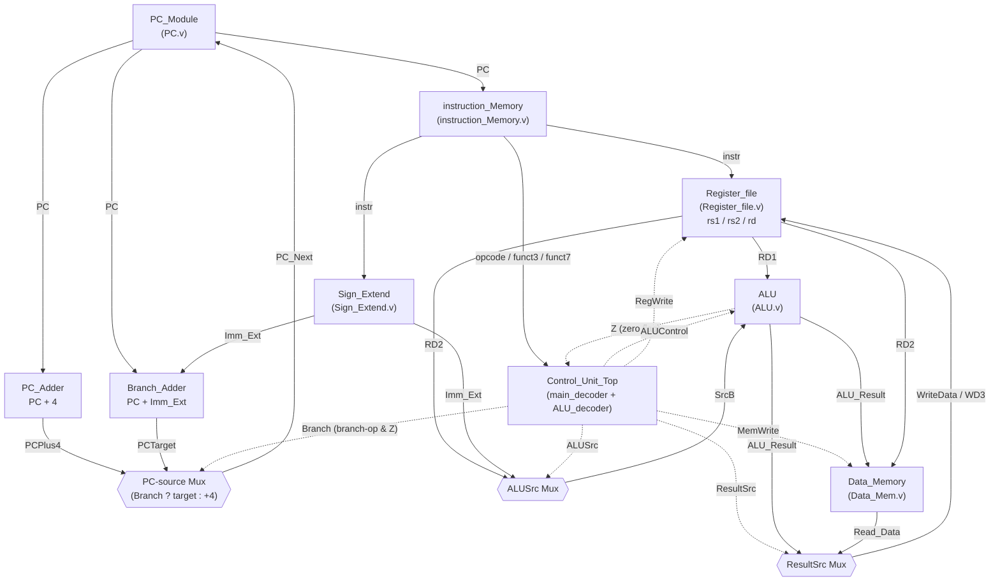

# RV32I Core — Single-Cycle → 5-Stage Pipeline

A from-scratch RV32I processor core in Verilog, built up in stages: a working single-cycle
datapath first, with a 5-stage pipelined version (hazard detection, forwarding, stalling,
flushing) in active development.

> **Status:** ✅ Single-cycle core implemented and simulated · 🚧 5-stage pipeline in progress
>
> This repo is being developed and documented openly as I build it, so the pipeline stages
> will land incrementally rather than all at once.

## Overview

This project implements the classic RISC-V RV32I datapath (Harris & Harris–style
single-cycle architecture) as a foundation, before extending it into a 5-stage pipeline
(IF → ID → EX → MEM → WB). The end goal is a pipelined core with forwarding/hazard
resolution, verified in simulation and on a PYNQ-Z2 FPGA.

## Current Progress

### ✅ Single-Cycle Core (`single_core/`)
A complete, simulated single-cycle RV32I datapath supporting core R-type, I-type,
load/store, and branch instructions.

| Module | File | Function |
|---|---|---|
| `PC_Module` | `PC.v` | Program counter register |
| `PC_Adder` | `PC_Adder.v` | PC+4 / branch target adder |
| `instruction_Memory` | `instruction_Memory.v` | Instruction fetch memory |
| `Register_file` | `Register_file.v` | 32×32-bit register file, dual read / single write |
| `Sign_Extend` | `Sign_Extend.v` | Immediate sign extension |
| `ALU` | `ALU.v` | Arithmetic/logic unit (add, sub, and, or, slt, +flags) |
| `ALU_decoder` | `ALU_decoder.v` | Generates ALU control signal from opcode/funct3/funct7 |
| `main_decoder` | `main_decoder.v` | Top-level control signal generation |
| `Control_Unit_Top` | `Control_Unit_Top.v` | Wraps main + ALU decoders |
| `Data_Memory` | `Data_Mem.v` | Load/store data memory |
| `Single_Cycle_Top` | `Single_Cycle_Top.v` | Top-level datapath integration |
| `Single_Cycle_Top_TestBench` | `Single_Cycle_Top_TestBench.v` | Clock/reset-driven testbench |

**Instructions supported:** R-type (`add`, `sub`, `and`, `or`, `slt`), I-type (`addi`, `lw`),
S-type (`sw`), B-type (`beq`).

#### Datapath Diagram



### 🚧 5-Stage Pipeline (`src/`)
Work in progress. Target architecture:

- **IF** – Fetch
- **ID** – Decode / register read
- **EX** – ALU / branch resolution
- **MEM** – Data memory access
- **WB** – Register writeback

Planned features as pipeline registers go in: data hazard **forwarding** (EX/MEM → EX),
**load-use stalling**, and **control hazard flushing** on taken branches, followed by
FPGA verification on a **PYNQ-Z2**.

## Repository Structure

```
.
├── docs/
│   └── RISC-V Project.md   # Design notes / project journal
├── single_core/            # Complete single-cycle RV32I implementation + testbench
│   ├── *.v                  # Datapath and control modules
│   ├── Single_Cycle_Top_TestBench.v
│   └── Single_Cycle_Top_TestBench.vcd(.gtkw)  # Simulation waveform + GTKWave session
└── src/
    └── Fetch_Cycle          # Placeholder for pipeline IF-stage work (not started yet)
```

## Simulation

Modules are built with [Icarus Verilog](http://iverilog.icarus.com/) and viewed with
[GTKWave](http://gtkwave.sourceforge.net/).

```bash
cd single_core

# Compile
iverilog -o out.vvp Single_Cycle_Top_TestBench.v

# Run
vvp out.vvp

# View waveforms
gtkwave Single_Cycle_Top_TestBench.vcd
```

The testbench drives `clk`/`rst` and preloads a test instruction into instruction memory
(`instruction_Memory.v`) — edit the `initial` block there to load your own test programs.

## Recent Fixes

- **Branch resolution now works.** Previously `beq` was decoded but never redirected fetch:
  the ALU's `Z` (zero) flag was left unconnected and `Control_Unit_Top` hardcoded `zero = 0`,
  and there was no branch-target adder or PC-source mux at all — `PC_Module` only ever
  received `PC + 4`. Fixed by:
  - Wiring `ALU.Z` → `Control_Unit_Top`'s new `zero` input (`Single_Cycle_Top.v`,
    `Control_Unit_Top.v`)
  - Adding a second `PC_Adder` instance computing `PC + Imm_Ext` (the branch target)
  - Adding a mux on `PC_Module`'s `PC_NEXT` input selecting the branch target vs. `PC+4`,
    driven by `Branch` (`Control_Unit_Top`'s `PCSrc = branch-op & zero`)
  - Verified with a scratch regression program (`addi x1,5` / `addi x2,5` / `beq x1,x2,+8` /
    `addi x3,99` / `addi x4,7`) confirming the branch is taken, the instruction after it is
    skipped, and execution resumes correctly at the target.
- **Register file reset now actually clears registers.** `Register_file.v` previously only
  forced *reads* to zero while `rst` was asserted, without ever clearing the underlying
  `Register` array. It now synchronously zeroes all 32 registers on reset.

## Roadmap

- [x] Single-cycle RV32I datapath (fetch, decode, execute, memory, writeback in one cycle)
- [x] Testbench + waveform verification
- [ ] Pipeline registers (IF/ID, ID/EX, EX/MEM, MEM/WB)
- [ ] Hazard detection unit + load-use stall logic
- [ ] EX/MEM and MEM/WB forwarding paths
- [ ] Branch flush logic.  
- [ ] PYNQ-Z2 FPGA synthesis and on-board verification

## Author

**Swastik** ([@dr-paradox-design](https://github.com/dr-paradox-design)) — B.Tech Electrical
Engineering, NIT Rourkela. Built as part of an ongoing push into digital/ASIC design
fundamentals.

## License

No license file yet — add one (MIT is a common choice for educational cores) if you want
others to freely reuse this.
