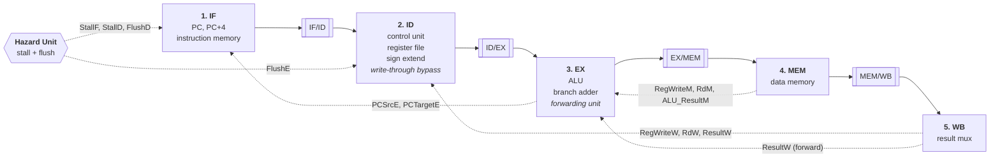
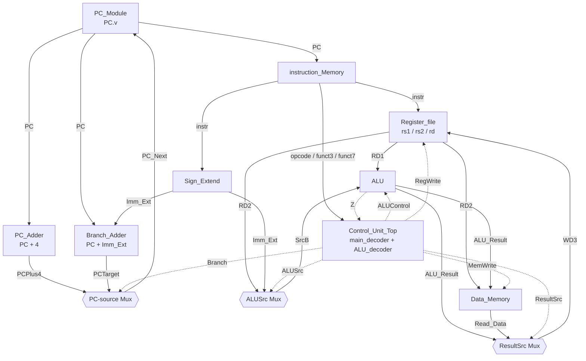

# RV32I Core — Single-Cycle → 5-Stage Pipeline

A from-scratch RV32I processor core in Verilog, built in stages: a working Harris & Harris–style
single-cycle datapath first, then a 5-stage pipeline (IF → ID → EX → MEM → WB) with forwarding,
hazard detection, stalling and flushing — with FPGA verification on a PYNQ-Z2 as the end goal.

> **Status:** ✅ Single-cycle core — 12/12 self-checking regression ·
> ✅ 5-stage pipeline with **complete hazard handling** — forwarding, load-use stalling and
> branch flushing — 17/17 regression ·
> 🚧 FPGA synthesis next
>
> Developed and documented openly as I build it, so pipeline features land incrementally.

**`src/program.hex` now contains zero NOPs.** Every hazard is resolved in hardware, so
ordinary RV32I code runs correctly without being hand-scheduled around the pipeline's
internal timing. The pipelined regression asserts the single-cycle core's **same 12
architectural results** — the two cores differ in schedule, not in what the program computes —
plus **5 more that exist only to prove the hazard hardware works.**

| Document | Covers |
|---|---|
| [**docs/RV32I_Single_Cycle_Core.pdf**](docs/RV32I_Single_Cycle_Core.pdf) | The single-cycle datapath, control tables, the branch-resolution post-mortem, verification strategy |
| [**docs/RV32I_Pipeline_Stages.pdf**](docs/RV32I_Pipeline_Stages.pdf) | How `src/` splits that datapath into five stages: the four pipeline registers and the backward paths |

## Architecture

### 5-stage pipeline (`src/`)

Five stage modules separated by four pipeline registers (the `[[double-bracket]]` blocks).
Solid arrows flow forward — one instruction advances one stage per clock edge. The dotted
arrows run **backwards**, and they are where all the difficulty in pipelining comes from:


```mermaid
flowchart LR
    IF["<b>1. IF</b><br/>PC, PC+4<br/>instruction memory"]
    R1[["IF/ID"]]
    ID["<b>2. ID</b><br/>control unit<br/>register file<br/>sign extend<br/><i>write-through bypass</i>"]
    R2[["ID/EX"]]
    EX["<b>3. EX</b><br/>ALU<br/>branch adder<br/><i>forwarding unit</i>"]
    R3[["EX/MEM"]]
    MEM["<b>4. MEM</b><br/>data memory"]
    R4[["MEM/WB"]]
    WB["<b>5. WB</b><br/>result mux"]
    HZ{{"<b>Hazard Unit</b><br/>stall + flush"}}

    IF --> R1 --> ID --> R2 --> EX --> R3 --> MEM --> R4 --> WB

    EX -. "PCSrcE, PCTargetE" .-> IF
    WB -. "RegWriteW, RdW, ResultW" .-> ID
    MEM -. "RegWriteM, RdM, ALU_ResultM" .-> EX
    WB -. "ResultW (forward)" .-> EX
    HZ -. "StallF, StallD, FlushD" .-> IF
    HZ -. "FlushE" .-> ID
```

| Backward path | Why it exists | Handled by | Cost |
|---|---|---|---|
| `RegWriteM`, `RdM`, `ALU_ResultM` (MEM → EX) | The producer is 1 instruction ahead; its result exists but hasn't been committed | EX/MEM forwarding | **0 cycles** |
| `RegWriteW`, `RdW`, `ResultW` (WB → EX) | The producer is 2 instructions ahead | MEM/WB forwarding | **0 cycles** |
| `RegWriteW`, `RdW`, `ResultW` (WB → ID) | Producer exactly 3 ahead — writes the register file on the very edge the consumer latches its operands | Decode write-through bypass | **0 cycles** |
| `StallF`, `StallD`, `FlushE` (Hazard → IF, ID) | A load's data doesn't exist anywhere on-chip until MEM completes — forwarding has nothing to grab | 1-cycle stall, then MEM/WB forwarding | **1 cycle** |
| `PCSrcE`, `PCTargetE` + `FlushD`, `FlushE` (EX → IF, ID) | A branch resolves in EX; two instructions behind it are already in flight | Flush IF/ID and ID/EX | **2 cycles** |

Every cost above is now paid **in hardware**. Nothing is left to the programmer — see
[`src/program.hex`](src/program.hex), which contains no NOPs at all.

### Single-cycle datapath (`single_core/`)

The reference implementation the pipeline was cut from (dotted lines are control signals):


```mermaid
flowchart TD
    PC["PC_Module<br/>PC.v"]
    PCADD["PC_Adder<br/>PC + 4"]
    BADD["Branch_Adder<br/>PC + Imm_Ext"]
    PCMUX{{"PC-source Mux"}}
    IMEM["instruction_Memory"]
    REGFILE["Register_file<br/>rs1 / rs2 / rd"]
    SEXT["Sign_Extend"]
    CTRL["Control_Unit_Top<br/>main_decoder + ALU_decoder"]
    SRCB{{"ALUSrc Mux"}}
    ALU["ALU"]
    DMEM["Data_Memory"]
    WDMUX{{"ResultSrc Mux"}}

    PC -->|PC| PCADD
    PC -->|PC| BADD
    PC -->|PC| IMEM
    PCADD -->|PCPlus4| PCMUX
    BADD -->|PCTarget| PCMUX
    PCMUX -->|PC_Next| PC

    IMEM -->|instr| REGFILE
    IMEM -->|instr| SEXT
    IMEM -->|opcode / funct3 / funct7| CTRL

    REGFILE -->|RD1| ALU
    REGFILE -->|RD2| SRCB
    REGFILE -->|RD2| DMEM
    SEXT -->|Imm_Ext| SRCB
    SEXT -->|Imm_Ext| BADD
    SRCB -->|SrcB| ALU

    ALU -->|ALU_Result| DMEM
    ALU -->|ALU_Result| WDMUX
    DMEM -->|Read_Data| WDMUX
    WDMUX -->|WD3| REGFILE

    ALU -.->|Z| CTRL
    CTRL -.->|ALUControl| ALU
    CTRL -.->|ALUSrc| SRCB
    CTRL -.->|RegWrite| REGFILE
    CTRL -.->|MemWrite| DMEM
    CTRL -.->|ResultSrc| WDMUX
    CTRL -.->|Branch| PCMUX
```

### Modules (`src/`) — the pipeline

| Module (file) | Role |
|---|---|
| `Fetch_Cycle` (`Fetch_Cycle.v`) | Stage 1 — PC, PC+4, instruction memory, PC-source mux (with stall hold), **IF/ID register** (with stall + flush) |
| `Decode_Cycle` (`Decode_Cycle.v`) | Stage 2 — control unit, register file, sign extend, write-through bypass, **ID/EX register** (with flush) |
| `Execute_Cycle` (`Execute_Cycle.v`) | Stage 3 — ALU, branch adder, branch decision, **forwarding unit**, **EX/MEM register** |
| `Memory_Cycle` (`Memory_Cycle.v`) | Stage 4 — data memory, **MEM/WB register** |
| `Writeback_Cycle` (`Writeback_Cycle.v`) | Stage 5 — result mux only; no pipeline register (there is no stage 6) |
| `Hazard_Unit` (`Hazard_Unit.v`) | **Not a stage** — sits beside the pipeline; load-use detection and branch flush control |
| `Pipeline_Top` (`Pipeline_Top.v`) | Wiring and includes only — no logic |

Every signal carries a stage suffix (`F` `D` `E` `M` `W`) naming where it lives, so `RD2E`
and `RD2M` are visibly the same wire one cycle apart. The moment a signal crosses a pipeline
register, its letter changes.

### Modules (`single_core/`) — reused unchanged

Not one line of these was edited to pipeline the core. Pipelining a processor doesn't change
its functional units — it puts registers *between* them. Keeping `single_core/` frozen also
means any pipeline failure is provably a pipelining bug.

| Module (file) | Role |
|---|---|
| `PC_Module` (`PC.v`) | Program counter register |
| `PC_Adder` (`PC_Adder.v`) | Generic adder — instanced twice, for `PC+4` and the branch target |
| `instruction_Memory` (`instruction_Memory.v`) | Instruction fetch memory, loads `program.hex` |
| `Register_file` (`Register_file.v`) | 32×32-bit, dual read / single write |
| `Sign_Extend` (`Sign_Extend.v`) | I / S / B-type immediate extension |
| `ALU` (`ALU.v`) | add, sub, and, or, slt + Z/N/C/V flags |
| `ALU_decoder` (`ALU_decoder.v`) | ALU control from `ALUOp`/`funct3`/`funct7` |
| `main_decoder` (`main_decoder.v`) | Top-level control signal generation |
| `Control_Unit_Top` (`Control_Unit_Top.v`) | Wraps main + ALU decoders |
| `Data_Memory` (`Data_Mem.v`) | Load/store data memory |
| `Single_Cycle_Top` (`Single_Cycle_Top.v`) | Datapath integration |

### Hazard handling

The distance between a producer and its consumer decides which mechanism handles it. The three
zero-cost mechanisms partition that axis cleanly — no overlap, and (now) no gap:

| Producer distance | Mechanism | Where | Cost |
|---|---|---|---|
| 1 instruction back | EX/MEM forwarding | `Execute_Cycle.v` | 0 cycles |
| 2 instructions back | MEM/WB forwarding | `Execute_Cycle.v` | 0 cycles |
| **3 instructions back** | **Decode write-through bypass** | `Decode_Cycle.v` | 0 cycles |
| 4+ instructions back | Ordinary register-file read — already committed | — | 0 cycles |

**Distance 3 was a real hole, and closing it is the subtle part.** Forwarding reaches back two
stages; a plain register-file read is only safe from four back. At exactly three, the producer
is in WB writing the register file on the *very clock edge* the consumer's ID/EX register
latches its operands — so the consumer reads the stale value — and by the time the consumer
reaches EX, the producer has already fallen off the end of both forwarding paths.

The textbook fix is a register file that writes in the first half of the clock cycle and reads
in the second. That would mean editing `single_core/Register_file.v`, which is shared verbatim
with the single-cycle core and deliberately frozen. So the same behaviour is reproduced in
combinational logic in `Decode_Cycle.v` instead — same result, zero changes to shared code.

Two hazards cost real cycles, because no amount of bypassing can create a value that doesn't
exist yet or un-fetch an instruction that shouldn't have been fetched:

| Hazard | Why forwarding can't fix it | Mechanism | Cost |
|---|---|---|---|
| **Load-use** | While the consumer is in EX, the `lw` is still in MEM — the EX/MEM register holds the load's *address*, not its data | Stall 1 cycle, then MEM/WB forwarding applies | 1 cycle |
| **Taken branch** | `PCSrcE` isn't known until EX; two wrong-path instructions are already in flight | Flush IF/ID and ID/EX | 2 cycles |

`WAR` and `WAW` hazards **cannot occur** here — every instruction reads in ID and writes in WB
in strict program order, so they're a property of out-of-order machines, not this one.
Structural hazards are also impossible by construction: instruction and data memory are
physically separate (a Harvard split), so IF and MEM never contend for a port.

### Instruction support

Both cores support the same subset. The pipelined regression asserts the single-cycle core's
12 results, plus 5 more covering hazard hardware the single-cycle core cannot need:

| Type | Instructions | Verified by |
|---|---|---|
| R-type | `add` `sub` `and` `or` `slt` | `x3=8`, `x4=2`, `x5=1`, `x6=7`, `x7=1` / `x8=0` |
| I-type | `addi` `lw` | `x1=5`, `x2=3` / `x9=8` |
| S-type | `sw` | stores `x3` to `mem[0]`, read back into `x9` |
| B-type | `beq` | not taken → `x10=1`; taken → `x11`/`x14` stay `0`, `x12=7` |
| *hazards* | *(pipeline only)* | `x13=9` load-use stall · `x17=7` distance-3 bypass |

## Simulation

Built with [Icarus Verilog](http://iverilog.icarus.com/), waveforms viewed in
[GTKWave](http://gtkwave.sourceforge.net/).

**Pipelined core:**

```bash
cd src

iverilog -I ../single_core -o out.vvp Pipeline_Top_TestBench.v   # compile
vvp out.vvp                                                      # run the regression
gtkwave Pipeline_Top_TestBench.vcd                               # inspect waveforms
```

> The `-I ../single_core` flag is **required**. A plain
> `` `include "../single_core/Control_Unit_Top.v" `` won't work: that file itself does
> `` `include "main_decoder.v" ``, and a nested include resolves relative to the *current
> working directory*, not the including file — so the inner include fails. The search path
> resolves correctly at every level.

**Single-cycle core:**

```bash
cd single_core

iverilog -o out.vvp Single_Cycle_Top_TestBench.v   # compile
vvp out.vvp                                        # run the regression
gtkwave Single_Cycle_Top_TestBench.vcd             # inspect waveforms
```

Both testbenches are **self-checking** — they assert the expected final register state rather
than relying on a manual waveform read:

```
=== 5-stage pipelined RV32I regression (src/program.hex) ===
-- baseline arithmetic (same 12 values as the single-cycle core)
  ok  : x1 = 5
  ...
  ok  : x12 = 7
-- hazard hardware (would fail on the pre-hazard-unit build)
  ok  : x13 = 9
  ...
  ok  : x17 = 7
RESULT: PASS - all 17 checks passed
```

`vvp` also prints a `$readmemh: Not enough words in the file for the requested range` warning.
That one is expected and harmless — the program is far shorter than the 1024-word instruction
memory, and the remainder is deliberately zero-filled with NOPs.

### Running your own program

Programs live in [`src/program.hex`](src/program.hex) and
[`single_core/program.hex`](single_core/program.hex) — one 32-bit instruction per line in hex,
`//` comments allowed — and are loaded with `$readmemh`, so swapping programs does **not**
require editing or recompiling the RTL. If you change a program, update the `check_reg`
expectations at the bottom of the matching testbench.

✅ **No hazard scheduling is required.** Both cores now run ordinary RV32I code — dependent
instructions can sit back to back, `lw` can be followed immediately by a use of its result,
and branches need no delay slots. If you're comparing against an older revision of this repo,
note that this is new: `src/program.hex` used to require 3 NOPs between dependent instructions
and 2 after every taken branch.

## Repository Structure

```
.
├── docs/
│   ├── RISC-V Project.md              # Design notes / project journal
│   ├── RV32I_Single_Cycle_Core.pdf    # Single-cycle core documentation
│   ├── RV32I_Pipeline_Stages.pdf      # Pipeline implementation walkthrough
│   ├── generate_pdf.py                # Regenerates the single-cycle PDF
│   └── generate_pipeline_pdf.py       # Regenerates the pipeline PDF
├── single_core/             # Single-cycle RV32I implementation + regression
│   ├── *.v                  # Datapath and control modules (reused by src/, unchanged)
│   ├── program.hex          # Test program, loaded via $readmemh
│   ├── Single_Cycle_Top_TestBench.v           # Self-checking testbench
│   └── Single_Cycle_Top_TestBench.vcd(.gtkw)  # Waveform + GTKWave session
└── src/                     # 5-stage pipeline + regression
    ├── Fetch_Cycle.v        # Stage 1 (IF)  + IF/ID register
    ├── Decode_Cycle.v       # Stage 2 (ID)  + ID/EX register
    ├── Execute_Cycle.v      # Stage 3 (EX)  + EX/MEM register
    ├── Memory_Cycle.v       # Stage 4 (MEM) + MEM/WB register
    ├── Writeback_Cycle.v    # Stage 5 (WB)  — no register; loops back to ID
    ├── Hazard_Unit.v        # Stall + flush control (not a stage)
    ├── Pipeline_Top.v       # Wiring and includes only
    ├── program.hex          # Test program — zero NOPs; every line probes a hazard path
    └── Pipeline_Top_TestBench.v               # Self-checking testbench
```

Both PDFs are generated by the committed scripts (`python docs/generate_pipeline_pdf.py`), so
they're regenerable rather than binary blobs nobody can update.

## Design Notes

### Pipeline (`src/`)

- **Control signals are pipelined data.** `MemWrite` is decoded in ID but the data memory
  doesn't run until MEM, three cycles later. Wiring the decoder straight to the memory would
  make it obey whichever instruction happens to be in decode at that moment. So control bits
  ride the same pipeline registers as the data — each instruction drags a backpack of control
  bits down the pipe. `RegWrite` has the longest trip: decoded in ID, used in WB.
- **`Control_Unit_Top` is instantiated with `.zero(1'b1)` — this is deliberate, not the old
  bug.** The decoder computes `Branch = <is a branch opcode> & zero`, but in a pipeline the
  zero flag doesn't exist until the ALU runs in EX. Tying `zero` high extracts just the raw
  opcode bit (`x & 1 == x`); the real test is completed in EX as `PCSrcE = BranchE & ZeroE`.
  The logic isn't weakened — it's *split across two stages*. Contrast the genuine defect the
  single-cycle core once had, where the same port was hardcoded to `1'b0` (`x & 0 == 0`
  destroys the condition entirely).
- **The branch adder moved from IF to EX.** The target is `PC + immediate`, and the immediate
  doesn't exist until sign-extension runs in ID. Putting it in EX rather than ID keeps the
  target and the branch decision in one stage, so only *one* backward bundle routes up to
  fetch. Knock-on effect: `PC` must be carried IF → ID → EX.
- **`PC+4` is deliberately not pipelined.** Textbooks carry it to WB because `jal` writes the
  return address to `rd`. This core has no `jal`, so `PC+4` has exactly one consumer — the PC
  mux in fetch — and never leaves that stage. It goes in the moment `jal` does.
- **The 3-NOP rule was verified, not just derived** — back when it still existed. Rebuilding
  with only 2 NOPs produced `x3 = 5` instead of `8`: `x1` read correctly while `x2` was still
  stale, exactly the failure the arithmetic predicts. One operand correct and the other stale,
  in the same instruction, is a signature that doesn't happen by accident. Forwarding has since
  removed the rule entirely, but the same instruction is still the regression's sharpest probe —
  see the next note.
- **Every hazard mechanism is proven load-bearing by negative testing.** A passing regression
  only proves the hardware isn't broken *today*; it doesn't prove the hardware is doing
  anything. So each mechanism was disabled in turn and the failure compared against the value
  predicted in the source comments:

  | Disabled | Result | Predicted |
  |---|---|---|
  | EX/MEM forwarding | `x3 = 5` | ✅ `x2` reads stale `0` |
  | MEM/WB forwarding | `x3 = 3` | ✅ `x1` reads stale `0` |
  | Store-data forwarding (`WriteDataM <= RD2E`) | `x9 = 0` | ✅ `sw` stores stale `0` |
  | Load-use stall | `x13 = 1` | ✅ address forwarded instead of data |
  | Branch flush | `x11 = 99`, `x14 = 88` | ✅ both wrong-path instructions ran |
  | Decode write-through bypass | `x17 = 0` | ✅ stale `x12` at distance 3 |

  `add x3, x1, x2` is the sharpest single line: its two operands sit at *different* distances
  (2 and 1), so the two forwarding paths fail to **different wrong answers** — `3` versus `5` —
  and the regression names which path broke rather than just reporting a mismatch.
- **`WriteDataM` latches the *forwarded* rs2, not the raw one.** Easy to miss, because rs2 has
  two separate consumers in EX: the ALU's B operand and the store-data path. Fixing only the
  first leaves `sw` silently storing a stale value — one of the six failures tabulated above.
- **The PC is stalled without an enable pin.** `single_core/PC.v` is an unconditional
  flip-flop and is frozen, so `Fetch_Cycle.v` feeds the PC's own output back into its input
  instead: `PC <= PCF` is a no-op. An unconditional register plus a feedback mux *is* an
  enabled register — which is how the enable pin on a real LUT-flop is built underneath.
- **A bubble is not a special instruction.** Flushing a pipeline register just clears it to
  all-zeros, which is a control word with `RegWrite = 0` and `MemWrite = 0` — an entry that
  flows down the pipe doing arithmetic nobody reads and writing nothing anywhere. That's why
  the flush clause in `Decode_Cycle.v` shares a body with the *reset* clause: two very
  different reasons, one identical action.

### Single-cycle (`single_core/`)

- **Branch resolution was the subtle one.** `beq` decoded correctly but never redirected fetch:
  the ALU's `Z` flag was left unconnected, `Control_Unit_Top` hardcoded `zero = 0`, and there was
  no branch-target adder or PC-source mux at all — the PC only ever received `PC+4`. Fixed by
  wiring `Z` through and adding `Branch_Adder` plus the `PC_Next` mux. Search the RTL for
  `//FIX:` to see each change in context.
- **Reset clears the register file** rather than only forcing reads to zero, so stale values
  can't resurface once `rst` deasserts.
- **Both memories zero-fill at time 0**, so unwritten locations read as `0` — a harmless NOP in
  instruction memory — instead of smearing X through the register file and waveform.
- **Known limitation:** `slt` uses only the sign bit of `A - B` (the standard Harris & Harris
  simplification), so it is subtly incorrect on signed overflow.

## Roadmap

- [x] Single-cycle RV32I datapath
- [x] Branch resolution (zero flag → PC-source mux → branch target)
- [x] Self-checking regression covering every supported instruction
- [x] Pipeline registers (IF/ID, ID/EX, EX/MEM, MEM/WB) + self-checking pipeline regression
- [x] EX/MEM and MEM/WB forwarding paths — removed the 3 data-hazard NOPs
- [x] Decode write-through bypass — closed the distance-3 gap forwarding can't reach
- [x] Hazard detection unit + load-use stall logic
- [x] Branch flush logic — removed the 2 delay-slot NOPs
- [ ] PYNQ-Z2 FPGA synthesis and on-board verificationnow 
- [ ] *(stretch)* Branch prediction — flushing makes taken branches correct, not cheap
- [ ] *(stretch)* `jal` / `jalr`, `lb`/`lh`/`sb`/`sh`

The pipeline features had a concrete, falsifiable definition of done: **each one deletes NOPs
from `src/program.hex` while the assertions keep passing.** That is now complete — all 5 NOPs
are gone and the regression grew from 12 checks to 17, because each mechanism added a case that
*only* passes if that mechanism works. Forwarding came first (most NOPs removed for the least
logic), then the load-use stall, which is the one data hazard forwarding provably can't fix.

What remains is deliberately *not* correctness work. A taken branch still costs 2 flushed
cycles and a load-use pair still costs 1 stall; hiding those needs prediction, which is an
optimisation on top of a core that is already correct.

## Author

**Swastik** ([@dr-paradox-design](https://github.com/dr-paradox-design)) — B.Tech Electrical
Engineering, NIT Rourkela. Built as part of an ongoing push into digital/ASIC design fundamentals.

## License

No license file yet — MIT is a common choice for educational cores if you want others to reuse this.
